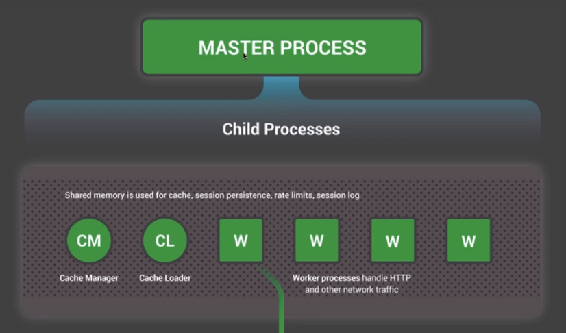
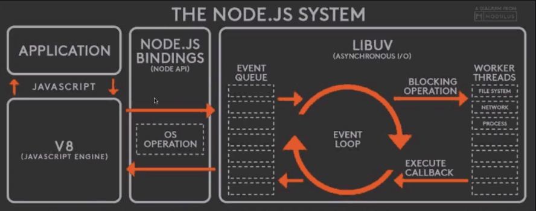
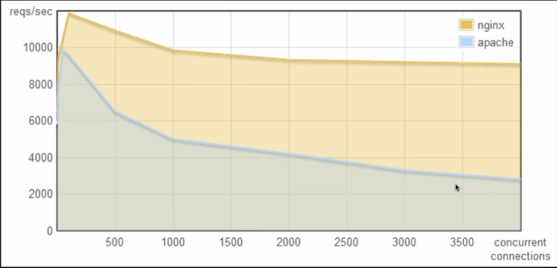

 ## Visão Geral do Node 
 JavaSript é a linguagem que te da a possibilidade de rodar a mesma linguagem tanto no browser como no server side no backEnd
 O principal Runtime de JavaScript do BackEnd  é o node.
 O Node usa o mesmo interpretador de JS do browser do chrome que no caso é o V8.
 Resumo: O conceito de Node é o ambiente de execução de JavaScript do lado do servidor, ou seja  não esta rodando dentro do Browser, porém é possivel sim Rodar JavaSctipt para controle da página , para deixar a página responsiva  e quem prove esse tipo de funcionalidade no Browser é o JavaSript. Muitas empresas Hoje tem o costume de adotar o JavaScript no BackEnd usando o Node.

 ## Historia do Node.
 Em resumo:  Criado por Ryan Dahl em 2009. Começou comparando os WebServer são eles o Nginx e o Apache, o Apache é um servgidor baseado em Threads cada requisição que chega no Apache ele Cria uma nova Threads para Tratar daquela requisição. O Nginx ele tem um único processo master, que esse processo de uma única Threads  fica executando e quando chega uma requisição , ele despacha essa requisição para tratar a parte de IO e essa Threads principal única fica tratando as requisições e despachando, e passa para um sub sistema para tratar essas requisições apartir de works. 

A imegem a seguir representa como o ngnix funciona:
 
 

 O Node inicialmente ele não nasceu para ser uma plataforma para rodar JavaScript no Backend , o  node foi criado para ser uma plataforma  que ele fizesse a parte de IO de uma forma mais correta. 
 O JavaScript veio como consequencia para conseguir a questão de ambientes assincrono, pois o JS foi criado para trabalhar em ambientes Assincrono.
 Exemplo : Você está no Browser sempre demandando coisas do servidor remoto e se fizesse tudo síncrono  dentro do JS seria Horrivel pois teria que esperar cada uma das ações de forma Síncrona para poder partir para a próxima ação e assim ficando inviável trabalhar com JS de Uma forma síncrona.
 Como JS é uma linguagem extremamente preparada para trabalhar com assincrono , ele acabou sendo a lingugem escolhida para trabalhar com o Node.

 Conceito de Threadss: Threadss é um processo uma linha de execução independente dentro do Computador. 

 ## Arquitetura do Node 
 Temos a nossa aplicação sendo escrita em JS e a Egine de interpretaçãoo de JS é a Engine mais robusta que é feita pelo Google que é a mesma Engine usada no Chrome que é a V8 e aqui você tem uma interligação interpretado. O Node  é uma soma do V8 mais o Lib Uv o V8 é um interpretador que vai ler o código que ira fazer chamadas a libUv que foi cirada para atender o Node foi escrita em C e é ela quem faz a parte toda do assincronismo do Node. Dentro do lib Uv  que é o responsavél por toda parte do IO Assincrono (IO é sempre que você precisa ler algo de um arquivo , sempre que você precisa fazer uma conexão com Rede , Exemplo quando tem que acessar um Banco de Dados você utiliza um IO pois tem que acessar um arquivo , mandar uma aquisição pela rede, ou então qualquer coisa que envolva entrada e saida  IO  é um processo lento, por isso você tem o Eventloop recebendo as requisições MonoThreads, então se você fizer um processo pesado você irá parar o event Loop e a próxima requisição só sera atendida quando o Event Loop tiver livre, então o ideal é que você não faça nenhum tipo de processamento pesado no event loop e ele irá ficar processando as requisições que irá passar as requisições para as Threads Trabalhadoras e essas Threads que de fato irá fazer o trabalho de acessar o disco, de acessar o banco de dados ou qualquer outra ação que demanda um grande tempo de espera uma vez que a ação foi terminada um  calloback é  executado  e a resposta é enviada.)
 O EventLoop  é uma Unica Threads para que o IO seja feita de uma forma Assincrona.
 Então isso garante que isso você tenha uma arquitetura mais Inteligente. 
 Exemplo: Se você tiver apenas uma Threads para cada requisição , ou seja tem mil usuarios acessando o site , siguinifica que você tem mil Threads.
 
 E esse mesmo modelo inspirou o Node , Veja a imagem a seguir : 
 .

 Veja no Gráfico a seguir  com relação  consumo de memória  com relação o tempo de Resposta ! : 
 
 

 Ou seja quanto mais usúario menos requisições por segundo o servidor consegue atender.

 Reusmo: O Node é um Runtime em JS que ele é formado por duas partes o V8 e livUb. O V8 que é o interpretador de JS de código aberto do Google.
 O livUb que é o que trata de forma assincrona a parte mais lenta do processo. 
 A ideia é que você saia o  mais rápido possivel do eventLoop para que ela, passe a sua requisição para as Threds tarabalhadoras que irá de fato ficar esperando que  você consiga pegar alguma informação do banco de dados , alguma informação que tenha haver com IO.
 Uma vez que esse trabalho é feito uma callback é chamada e a sua resposta enviada para o cliente.  
  Caso você fizer uma operaçõ pesada dentro do EventLoop ele irá travar para efetuar algum tipo de calculo e o próximo evento da fila irá ficar esperando até que o EventLoop esteja Livre.  