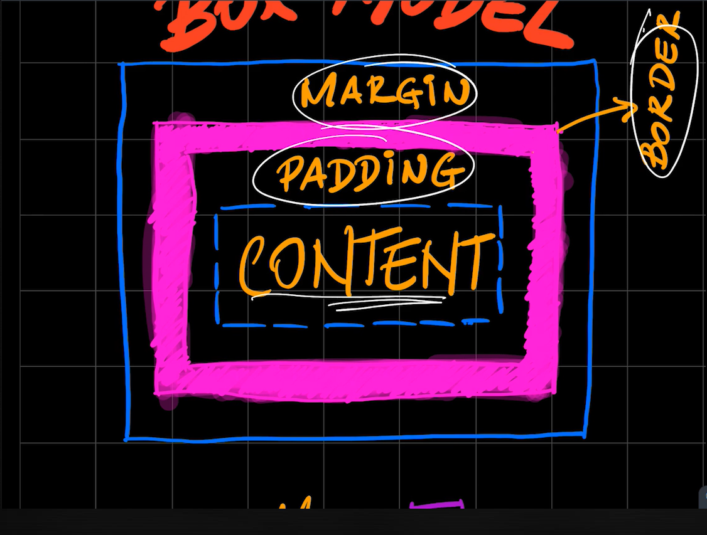

# Resumo
Neste Resumo vou exibir os principais tópicos das aulas de CSS e as lógicas aplicadas por trás de cada uma.

## Box Model

## Resumo Lógica Flex Grow
Quando você utiliza o Flex Grow serve para definir a lógica de como os  irá ocupar os espaços que estão faltando. 

No exemplo da imagem abaixo colocamos uma div  de 600px e com quatro elementos e cada um deles ocupando 100px ou seja ainda irá sobrar 200px para ser ocupado pelo resto que esta faltando
 
 Fazendo com que ele pega o espaço que sobrou soma os pesos de todos os itens e dividi isso pela quantidade de item.

